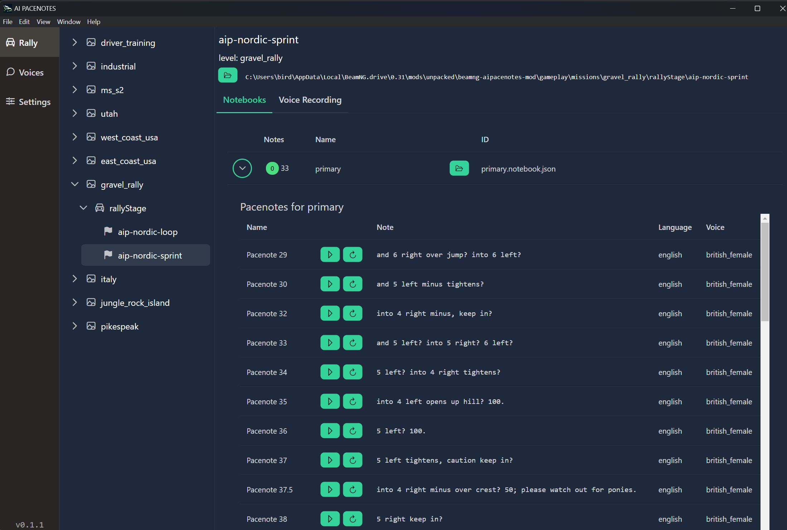

# Setup

This guide will get you up and running with the mod.

1. Install the mod. There are two options to install:
    1. The BeamNG mod repo: [https://www.beamng.com/resources/ai-pacenotes-rally-stages-pacenotes-editor.27352/](https://www.beamng.com/resources/ai-pacenotes-rally-stages-pacenotes-editor.27352/)
    1. The latest Github release: [https://github.com/alexebird/beamng-aipacenotes-mod/releases](https://github.com/alexebird/beamng-aipacenotes-mod/releases){:target="_blank"}.

1. Install the latest release of RaceLink from [https://github.com/alexebird/racelink/releases](https://github.com/alexebird/racelink/releases){:target="_blank"}.

   _RaceLink is a desktop app that powers the mod. It generates audio files for from pacenote text and provides optional voice recording._

   
