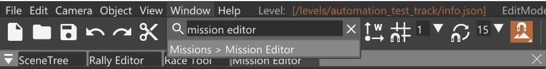
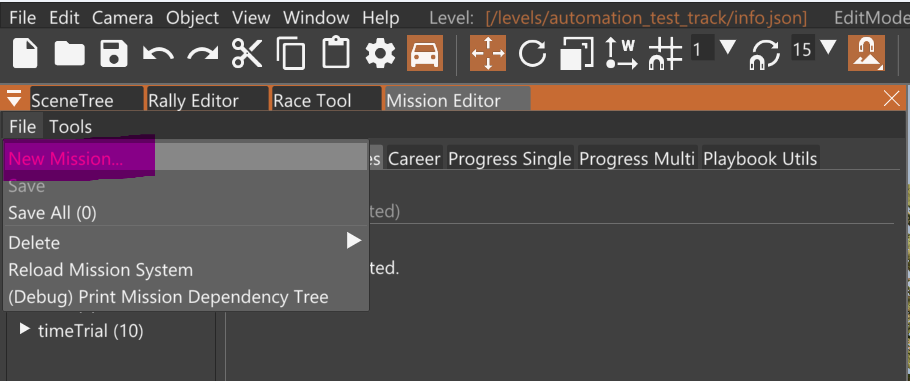
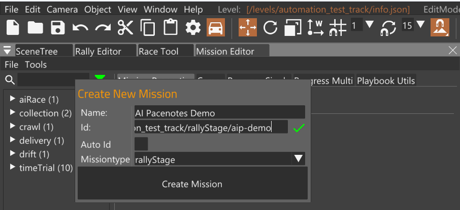
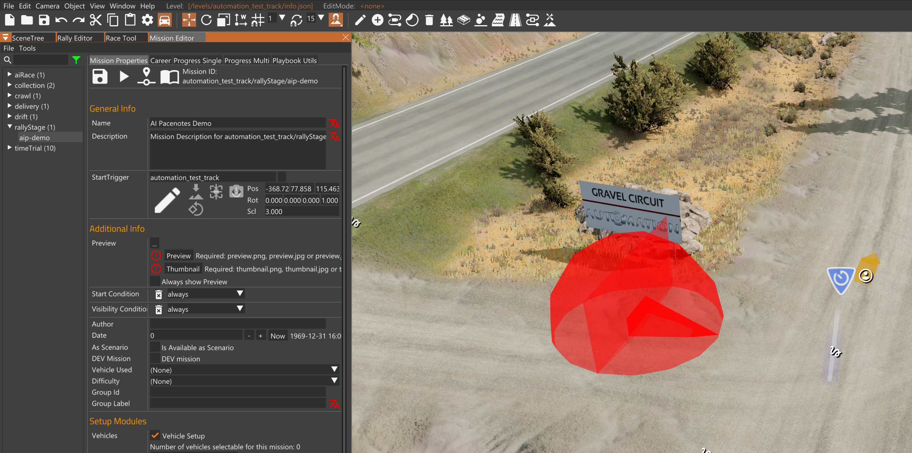
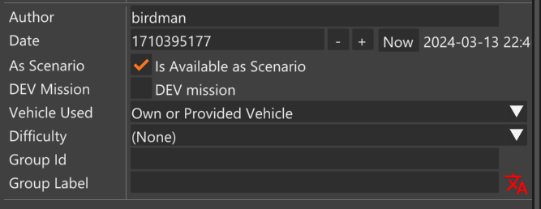
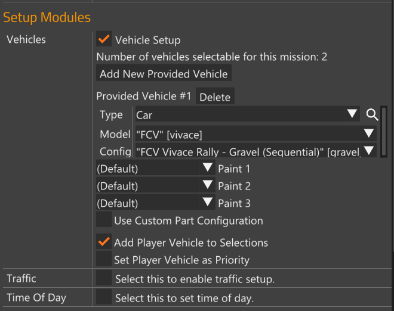
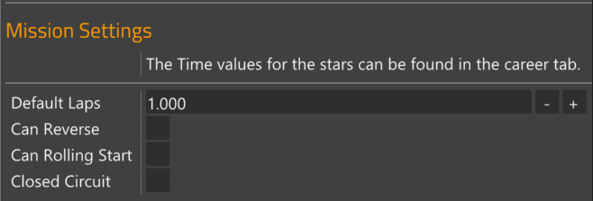
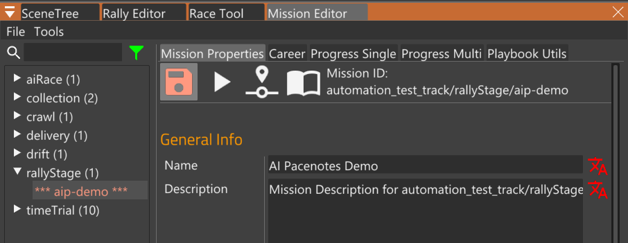
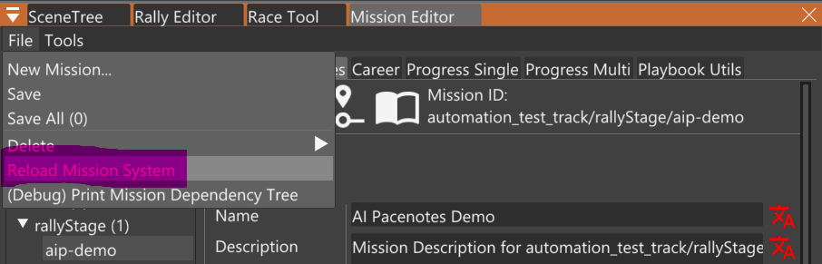

# Step 1: Create Mission

_This step takes about 1 min._

Create a rallyStage mission.

1. Open the World Editor by pressing the `F11` key.

1. Open the Mission Editor
   

1. Click `File > New Mission...`
   

1. Fill out the mission info.
   - Make sure you select `rallyStage` for the Missiontype.
   - I like to make all my missions start with the prefix `aip-` so they are easily searchable.

   

1. Set the Start Trigger. This determines where the mission activation point is.
   
   - The red waypoint is the Start Trigger for this mission, which you can edit in the Mission Editor.
   - You can see another mission's Start Trigger, which is blue and white
     marker. It becomes a larger blue circle when you are close enough. It also
     shows up on the Big Map.

1. Set mission settings:
   - author
   - date (click Now)
   - Check Available as Scenario
   - Vehicle Used: Own or Provided Vehicle

   

   - Click Add New Provided Vehicle. I usually set it to a rally car. This is the default vehicle for the mission.
   - Check Add Player Vehicle to Selection

   

   - Uncheck Closed Circuit (for most stages)

   

Scroll to the top of the Mission Editor and click the red save icon.

After saving, click `File > Reload Mission System`.

You're done creating the mission. Now we create the race.
