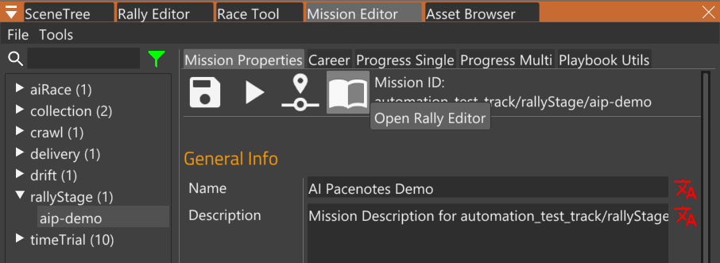
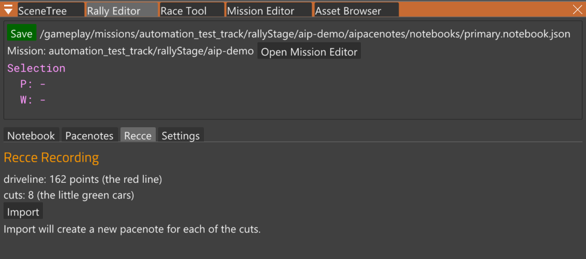

# Step 4: Create Pacenotes

_This step takes about 1 min._

In this step we turn the Recce recording into Pacenotes.

### Open Rally Editor

Go back into the World Editor by pressing `F11`.

In the Mission Editor, click the button below to open the Rally Editor.

In the Rally Editor, go to the Recce tab:

When the Recce tab is selected, you will see the recording in the 3D viewport:

The red line is the "driveline" or "snaproad" (the terms are used interchangeably).

The little green cars are the locations where you pressed the `cut` button.

In the above screenshot, you can also see the Rally Editor Preferences at the bottom of the tool.

### Import

In the Recce tab, click `Import`.

The Pacenotes tab will open, and you'll see the newly created Pacenotes in the 3D viewport.

Congratulations, you just made your first pacenotes!
