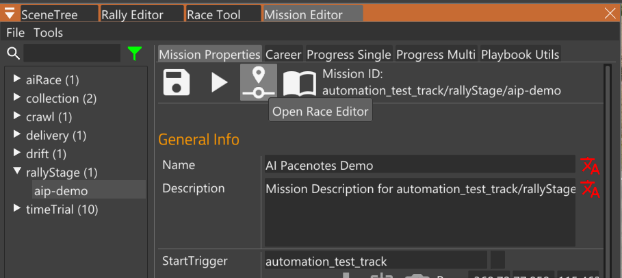
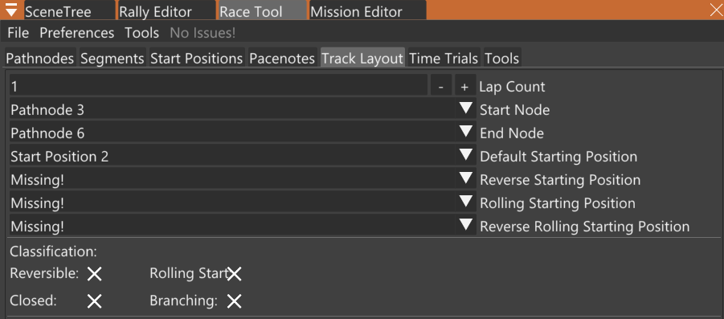
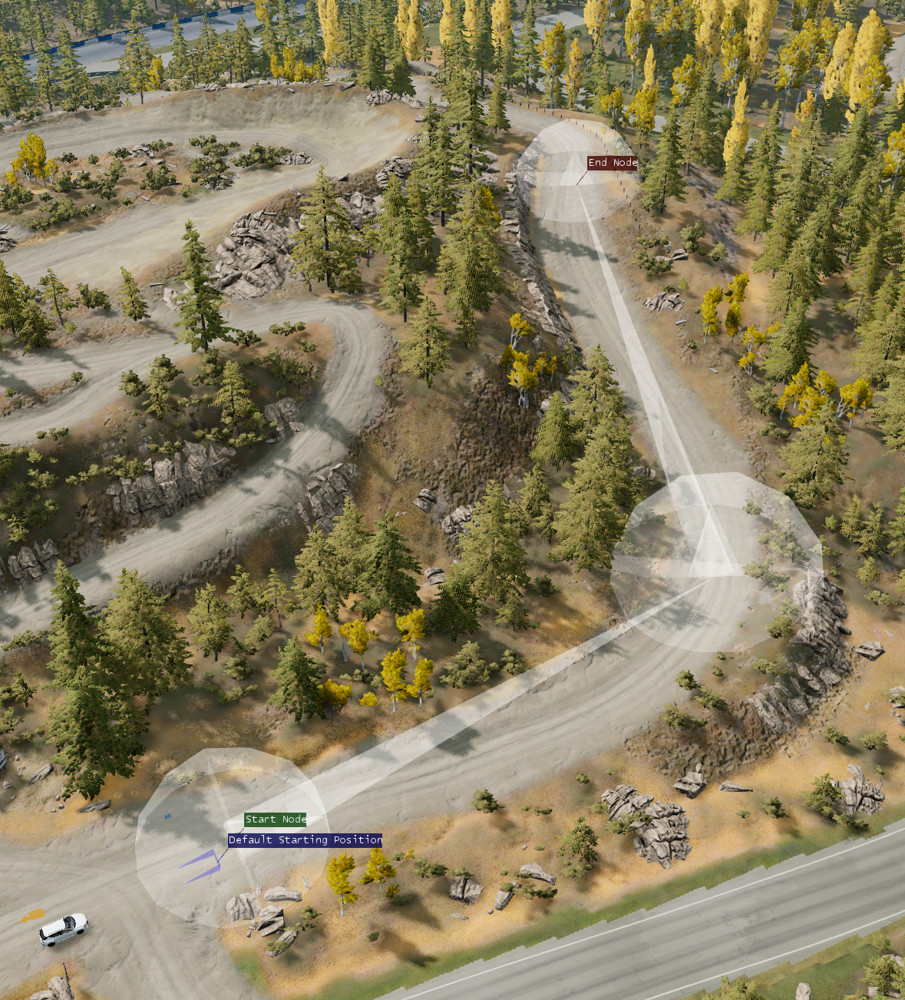

# Step 2: Create Race

_This step takes about 5 minutes._

In this step we create a race using the Race Tool.

The mod adds two new buttons to the Mission Editor.
- Open Race Editor
- Open Rally Editor

Click the Open Race Editor button. This will create the `race.race.json` file in the right place, and open the tool.

In the Race Tool, here are the steps:

1. Create a Start Position.
1. Create at least two Pathnodes, one right after the Start Position, and one
   for the Finish line. You should put more in between too. Make them extra
   large so there is no risk of missing them while you're driving.
1. Make sure the Track Layout tab has Start Node, End Node, Default Starting Position set.

   

   Make sure the tool says "No Issues!"

Here's the result:

