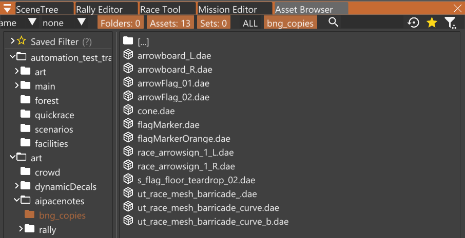

# Decorate Stage

_This step may consume your life._

Decorating the stage with signs, barriers, and spectators will bring it to life. Use your imagination!

The practical reason to do this is so you know where to drive during recce.
Otherwise you may have to remember where to go.

Adding a couple notes at junctions is all that is needed.

The mod includes copies of some of the game's stage-related assets in the Asset Browser folder `art/aipacenotes/bng_copies` for easy access.

There are also some custom-made assets in `art/aipacenotes/rally`.
