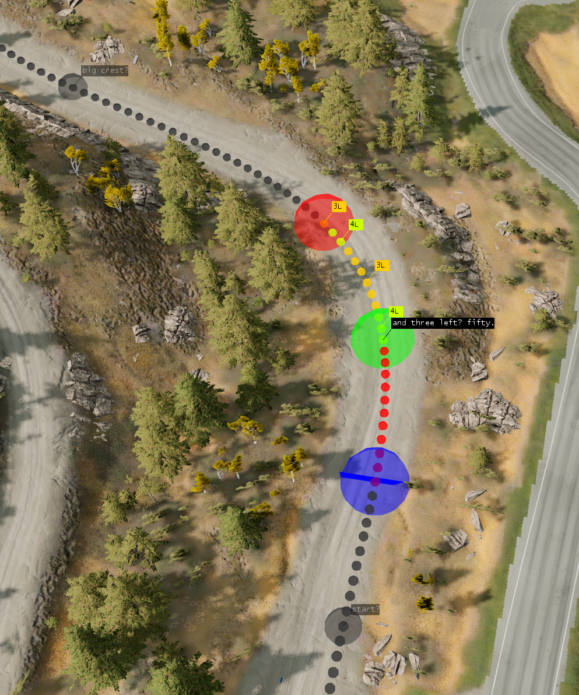

# Step 5: Refine Pacenotes

_The amount of time this step takes depends on the stage length._

In this step, we define each pacenote's waypoints and text.

### Pacenote Selection

Here's what you'll see if nothing is selected:

Hit `escape` or click away from a waypoint to deselect.

- Black pacenotes are OK.
- Red pacenotes need attention.

Select a pacenote. This can be done by:
- Clicking on it in the 3D viewport. (does not activate PacenoteCamera)
- Using the `1` and `2`, or `j` and `k` keybindings. (activates PacenoteCamera)
- Clicking on it in the Rally Editor pacenotes list. (activates PacenoteCamera)

Here's what you'll see when a pacenote is selected:

If you've activated the PacenoteCamera, you can use the right mouse button, or WASD keys to move the camera, and shift+pgup / shift+pgdown to zoom. Just like the vehicle orbit camera.

There are three "waypoints":
- Green: CornerStart
- Red: CornerEnd
- Blue: AudioTrigger

The snaproad has also changed colors to show the bounds of the selected pacenote.

Here are some fun tools:
- Press the `c` keybinding to show corner calls (like in the screenshot)
- Press the `space` keybinding to play the pacenote as a CameraPath. Press space again to stop. A purple dot will appear where you stopped, as a reference point.

With these tools, you can make sure the note is accurate.

### Define Corners

First we want to define the corners. This is important because distance calls are automatically calculated based on corner position.

Press the aqua-colored button in Rally Editor called `Change Edit Mode`. There are three edit modes:
- All - all waypoints are visible and no waypoints are locked.
- Corners - AudioTrigger waypoints are hidden.
- Audio Triggers - AudioTrigger waypoints are visible, and CornerStart/CornerEnd waypoints are locked and cannot be moved.

You can use the Corners edit mode while doing this.

### Create, Merge, Delete Pacenotes

To create a new pacenote, `ctrl+left mouse button` on the snaproad with no pacenote selected.

To merge the selected pacenote into the next pacenote, use the `Merge with Next` button in the Rally Editor.

To delete a pacenote, press `delete`, or use the Delete button in the Rally Editor.

### Update Pacenote Text

As you go, you can fill in the pacenote text by using the CornerCall and CameraPath tools mentioned above. This is where voice recording saves a lot of time.

Here, you can use the `j` and `k` keys to move up and down the pacenotes list. Use the `i` key to focus the cursor on the pacenote text field, edit the text, then hit enter.

Hit `ctrl+s` to save the Rally Editor.

Start RaceLink, and select your mission:

Wait a couple seconds and you should see the audio files being generated. Click the play button to hear the generated pacenote.

You should be able to leave RaceLink running in the background, and whenever you edit pacenote text, the audio files will be updated.

__NOTICE: RaceLink is very new software, so there may be bugs. 
Please report in the forum thread: [https://www.beamng.com/threads/ai-pacenotes-rally.96689/page-2#post-1696917](https://www.beamng.com/threads/ai-pacenotes-rally.96689/page-2#post-1696917)__

Test out whether you can hear the pacenotes by clicking the little white Play button near the note text, in the Rally Editor:

### Set AudioTriggers

Now, switch to Audio Triggers edit mode. You can use `1` and `2` to move up and down the pacenotes list. Drag the AudioTriggers to the desired locations.

Getting good AudioTrigger placement is challenging and rewarding.

If you're happy with the notes, and can hear them with the test button, now it's time to try out the stage!

### Test Stage

Exit the World Editor, and in the Recce App click `load` to reload your mission and pacenotes.

Now you should see your first pacenote in Freeroam, marked by a blue rectangle:

Drive through it and you should hear the pacenote.

Check out these buttons:

- `hide notes` - Hides the blue rectangles.
- `edit` - Switches to Recce Edit: activates the PacenoteCamera, enables the following controls:
  - `MoveAT` - buttons to move the AudioTrigger forward and backwards.
  - `Pacenote` - buttons to move the pacenote selection forward and backwards. The `P->V` button sets the selection to the pacenote closest to the vehicle.
  - `Vehicle` - buttons to move the vehicle spawn point to the next or previous AudioTrigger. The `V->P` button moves the vehicle to the selected pacenote.

- The text field will be populated with the selected pacenote's text. You can edit the text and the audio will be regenerated.
  - NOTE: there is a bug I haven't been able to figure out, where the text field stops responding to input. If that happens, hit `F5` to reload the game's UI.

Using these controls, you can drive a couple pacenotes at a time and see how you like them.

You may want to go back to the World Editor to make bigger changes more efficiently, then back to the recce app, etc, until the notes are sounding and feeling good. It's a fun process, especially when your times start getting faster!
