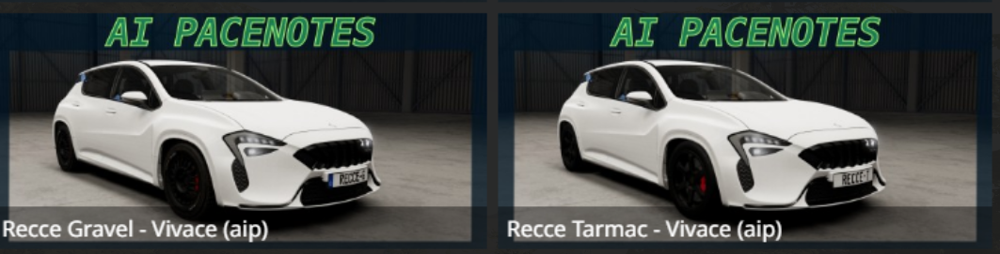

# Step 3: Record Snaproad

_The amount of time this step takes depends on the stage length, but at least you'll be driving!_

Record the Snaproad (also called the driveline) of the entire stage using the Recce app.

__A Snaproad of the entire route is required for making a stage.__

Here's a preview of the end result:

But first, some background...

### Recce Cars
Two Recce Car configs are offered: gravel and tarmac, found under the Cherrier FCV. You're welcome to use any car for recce, though.

### Recce UI Layout
Switch to the `[aipacenotes] Recce` UI Layout, at the top of the list.
If necessary, exit the World Editor by pressing `F11`.

Hit `escape` to bring up the main menu:

Click on `UI Apps`. The UI Apps menu will appear on the left:

### Recce UI Apps

You can see there are three new UI Apps included in the mod.

- The bottom left app is called `Codriver`
- The middle app is called `CornerCalls`
- The top right app is called `Recce`

`Codriver` controls the volume of the pacenotes, and plays the actual pacenote audio file behind the scenes.

___NOTICE: If you don't hear pacenotes, make sure the Codriver app is in your UI layout!!!___

`CornerCalls` shows the corner call based on the steering wheel angle. This is configurable in the file `/settings/aipacenotes/corner_angles.json`.
You can use this during voice-based recce to improve consistency.

The `Recce` app has a couple of features:
- controls recording.
- allows you to drive the stage and hear pacenotes without starting the mission.
- edit pacenotes without opening the World Editor.

Here's an overview of the controls for Step 3:

### Recording Controls
- driveline checkbox - enables recording a driveline.
- voice checkbox - enables voice recording.
- `start` - starts recording.
- `stop` - stops recording.
- `cut` - records corner locations. tracks the vehicle's position & steering wheel angle at the moment the cut happens.
  - If voice is enabled, also does speech-to-text on the audio recorded since the previous cut. (ie, it "cuts" the recording)
- `clear` - deletes all recording files. If you want to backup a recording, make a copy of this folder: `gameplay/missions/<level>/rallyStage/<mission>/aipacenotes/recce/primary/`.

### Mission Controls
- `refresh missions` - This will reload the dropdown box to the right with all the `rallyStage` missions available for the current level.
- `load` - loads the selected mission into the Recce App.
- `unload` - unloads the current mission.

The other controls will be explained after recording is done.

Because recording files are stored in the mission, you must load a mission before recording.

### Wheel Binding

In order to place corner locations (referred to as "cuts") as you drive, you should map the `cut` keybinding to a wheel button.
I like to map it to a button that is easy to press near my thumb.

Hit `escape` to bring up the main menu, then go to Options, then Controls.
Search for "aip", then under Gameplay map the "Cut Voice Transcription" to your button of choice. (note: the name includes the word "voice", but this action is not specific to voice -- needs to be renamed)

You don't have to do the wheel binding, or even use the Cut button at all. You can just record the driveline.

### Recording

With all that background info out of the way, it's time to record.

Click the `driveline` checkbox to enable it, and leave `voice` unchecked. Voice recording will be covered later.

Make sure your vehicle is positioned a bit _before_ the start line. And drive for a while past finish line before hitting stop.

Click `start`. Drive slowly along the stage, making smooth turns. Don't try to drive at race speed. (That will come soon!)

As you drive, hit the `cut` binding to record a corner, or any other feature you want to note. Later, each of these cut locations will be turned into a pacenote.

When you're done, click `stop`.

Now you're done with the recording step!
